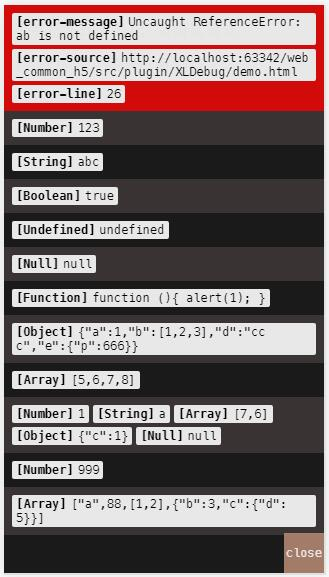

# XLDebug
移动端简易调试查看器 和 4指强制刷新彩蛋

### 简单说明
1. 可以使用 `requirejs` 和 `src` 两种方式引入
1. XLDebug.js 尽量尽早引入
1. 使用 console 会侵入原生，使得在chrome开发者工具中，看不到准确的定位。但好处就是不需要使用额外的函数打log。默认不开启


### 如何使用
1) **4指调试**
```
// 默认开启 4指调试。
// 关闭4指调试
XLDebug.finger.close();

// 开启指调试
// 如果想修改手指，传1个数字作为参数
XLDebug.finger.open();
```

2) **彩蛋log**
```
// 两个手指同时点击屏幕10次，就会弹出提示
// 默认指开启 xlconsole
// 如果要开启系统 console 的话：
XLDebug.log.openSysConsole();

// 关闭“彩蛋log调试”
XLDebug.log.close();

// 开启“彩蛋log调试”
XLDebug.log.open();
```

### Changelog
- 2016-05-18 | 添加了运行时错误的监听(window.onerror)

### 截图



